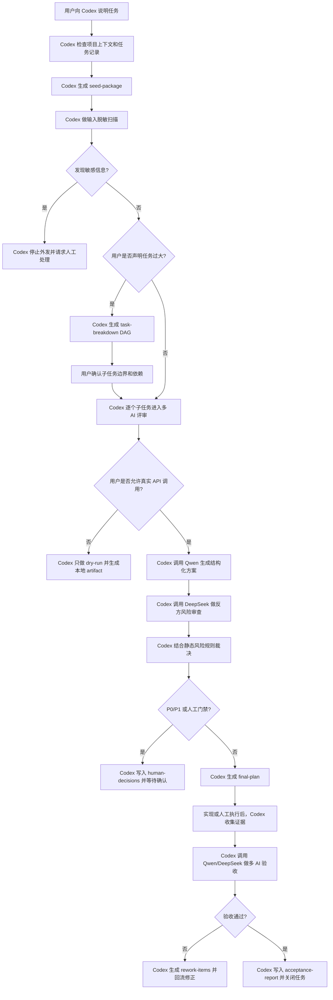
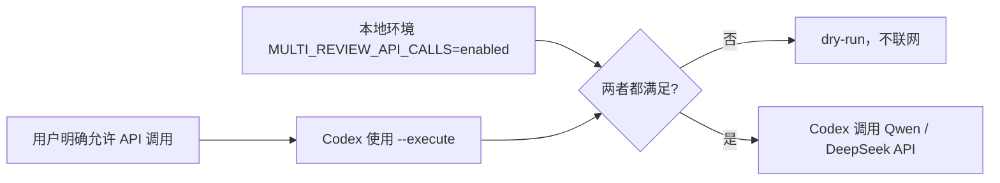
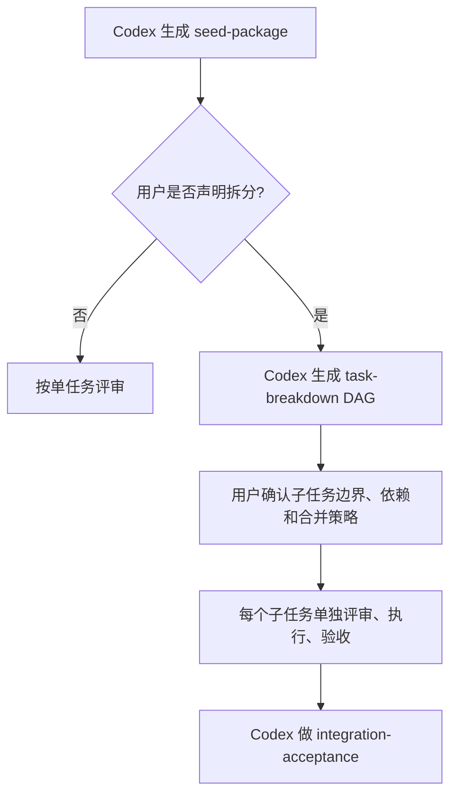
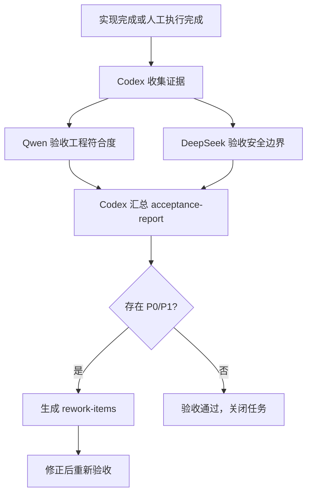

# Cursor_Kit

Cursor_Kit 是一个纯 Codex 主模板。根目录只保留 Codex 主动入口 `AGENTS.md`，项目状态、任务记录、经验沉淀和交接日志统一放在 `docs/agents/`。

Claude Code / Trae 不是根模板的默认入口；需要时可以通过 `export-rules` 按同一套任务记录逻辑生成兼容 rules 到目标项目。

## 快速开始

1. 把本仓库作为项目模板复制到新项目。
2. 让 Codex 读取根目录 `AGENTS.md`。
3. 开始复杂任务前查看 Codex 上下文：

```bash
python3 tools/agent_context.py status
```

4. 修改代码或文档前，确认是否已有任务记录；没有则创建：

```bash
python3 tools/agent_context.py new-task --title "任务标题"
```

5. 每轮结束前更新任务记录和 `docs/agents/WORKLOG.md`。
6. 如目标项目确实要让 Claude Code 或 Trae 接手，按需生成兼容 rules：

```bash
python3 tools/agent_context.py export-rules --agent claude --target-root /path/to/project
python3 tools/agent_context.py export-rules --agent trae --target-root /path/to/project
```

## 目录结构

```text
.
├── AGENTS.md
├── docs/agents/
│   ├── README.md
│   ├── archive/
│   │   └── README.md
│   ├── PROJECT_STATE.md
│   ├── WORKLOG.md
│   ├── LESSONS.md
│   ├── protocols/
│   │   └── multi-model-review.md
│   ├── templates/
│   │   └── multi-model-task-light.md
│   ├── skills/
│   │   └── multi-model-review/
│   │       └── SKILL.md
│   └── tasks/
│       └── TEMPLATE-task.md
├── tools/
│   └── agent_context.py
├── tests/
│   └── test_agent_context.py
└── .cursor-kit-version
```

## 共享上下文

- `docs/agents/PROJECT_STATE.md`：当前阶段目标、主线任务、活跃任务、最近交接。
- `docs/agents/WORKLOG.md`：按时间倒序记录 Codex 和按需派生 rules 的工作回合。
- `docs/agents/LESSONS.md`：长期适用的项目经验。
- `docs/agents/archive/`：`PROJECT_STATE.md` / `WORKLOG.md` 的历史快照与归档说明。
- `docs/agents/protocols/`：可选高级协作协议，例如多 AI 计划评审。
- `docs/agents/templates/`：可实例化的任务、方案、评审、裁决和验证模板。
- `docs/agents/skills/`：项目随附的 Codex Skill 说明，不是全局安装目录。
- `docs/agents/tasks/`：每个独立任务的过程记录。

## 使用方式：通过 Codex 协作

日常使用时，用户不需要直接运行 `tools/agent_context.py`。你只需要在 Codex 对话里说明目标、约束和是否允许调用外部模型；Codex 会按项目规则调用本地工具、更新 artifact、记录 WORKLOG，并在需要人工确认时停下来。

典型说法：

```text
开启一个多 AI 评审任务，目标是设计 XXX，不执行实现。
```

```text
这个任务太大，先拆成多个子任务再评审。
```

```text
允许调用 Qwen 和 DeepSeek API 做评审。
```

```text
实现完成了，走一轮多 AI 验收。
```

```text
只做 dry-run，不要调用外部 API。
```

Codex 内部会使用 `agent_context.py` 维护任务记录和多 AI artifact；CLI 是 Codex 的执行工具，不是用户主要交互界面。

## 多 AI 评审：Codex 使用视角

多 AI 评审有两条路径：

- `prompt-only`：Codex 生成 prompt，用户手动把 prompt 粘贴给外部模型，再把结果交回 Codex。
- `API-runner`：Codex 直接调用 Qwen / DeepSeek API，自动生成评审和验收 artifact。

推荐优先使用 API-runner。prompt-only 适用于没有 API Key、外部模型不可用、或需要人工隔离模型输入的场景。

### 整体运行机制



### 用户需要做什么

用户负责做决策，不负责跑命令。

| 场景 | 你对 Codex 说 | Codex 会做什么 |
|---|---|---|
| 开始评审 | `开启多 AI 评审任务，目标是...` | 创建任务记录，生成 seed package，先 dry-run。 |
| 任务过大 | `这个任务需要拆分` | 生成 task-breakdown，等待你确认子任务边界。 |
| 允许外部模型 | `允许调用 Qwen 和 DeepSeek API` | 检查双重开关，调用 API，写入评审 artifact。 |
| 禁止外发 | `不要调用外部 API` | 只生成本地 dry-run artifact 或 prompt-only 材料。 |
| 发现敏感信息 | 按 Codex 提示清理或拒绝外发 | Codex 不会把敏感输入发给外部模型。 |
| 实现完成 | `走一轮多 AI 验收` | 收集证据，调用 Qwen/DeepSeek 验收，生成 acceptance-report。 |
| 验收失败 | 确认 rework 方向 | Codex 写入 rework-items 并回流修正。 |

### Codex 内部会生成哪些文件

多 AI 评审和验收的长期记录在：

```text
docs/agents/tasks/<task-id>/api/
```

核心 artifact：

- `seed-package.json`：任务目标、约束、模型分工、裁决规则。
- `safety-input-sanitization.json`：输入脱敏扫描结果。
- `task-breakdown.json`：任务拆分 DAG，只有用户声明需要拆分时才生成有效拆分。
- `qwen-output.json`：Qwen 结构化方案。
- `deepseek-review.json`：DeepSeek 反方风险审查。
- `adjudication.json`：Codex 裁决。
- `human-decisions.json`：需要人工确认的事项。
- `final-plan.json`：最终计划。
- `calls-log.jsonl`：模型调用 usage 和状态，不记录密钥。
- `artifact-chain.jsonl`：关键 artifact 的 hash 链。
- `acceptance-evidence.json`：验收证据摘要。
- `qwen-acceptance.json`：Qwen 验收结果。
- `deepseek-acceptance.json`：DeepSeek 验收结果。
- `acceptance-report.json`：Codex 汇总验收报告。
- `rework-items.json`：返工项。

### 双重开关机制

真实调用 Qwen / DeepSeek API 必须同时满足两件事：



这表示：

- 你在对话里没有明确允许时，Codex 不应真实调用外部模型。
- 本地环境没有打开 `MULTI_REVIEW_API_CALLS=enabled` 时，即使 Codex 尝试执行也会被阻断。
- 默认是 dry-run。

### 任务拆分机制

任务不会自动拆分。只有你明确声明任务需要拆分时，Codex 才会拆。



建议在这些情况下声明拆分：

- 涉及 3 个以上模块、目录或职责域。
- 同时包含设计、实现、测试、文档、迁移、发布。
- 验收标准超过 7 条，且不能由同一组命令验证。
- 存在多个独立风险域，例如密钥安全、API 调用、状态机、CLI、artifact、验收报告。

### 多 AI 验收机制

评审回答“方案是否合理”，验收回答“实现是否满足方案”。



验收重点：

- Qwen：流程、schema、artifact、错误处理、成本记录是否符合计划。
- DeepSeek：密钥处理、双重开关、失败降级、人工门禁、敏感信息泄露。
- Codex：汇总证据，判断 pass/fail，写入 rework 或关闭任务。

### 安全约定

- 真实密钥只放在 `.env.local` 或环境变量里，不写入对话、文档或日志。
- 输入脱敏命中时禁止外发给外部模型。
- Qwen 或 DeepSeek 不可用时等待，不用缺失模型结果生成可执行 final plan。
- 模型输出解析失败时不合成可执行计划。
- token/cost 只记录，不设置硬上限，不阻断调用。
- 所有长期事实写入 `docs/agents/tasks/` 和 `docs/agents/WORKLOG.md`。

## 本地工具（Codex 内部使用）

这些命令主要给 Codex 或维护者使用。日常协作时，用户直接在对话里提出目标即可。

```bash
python3 tools/agent_context.py status
python3 tools/agent_context.py validate
python3 tools/agent_context.py new-task --title "示例任务"
python3 tools/agent_context.py multi-review init --title "示例多 AI 任务" --mode full
python3 tools/agent_context.py multi-review api-plan --task <task-id>
python3 tools/agent_context.py multi-review api-plan --task <task-id> --execute
python3 tools/agent_context.py multi-review api-accept --task <task-id>
python3 tools/agent_context.py export-rules --agent all --target-root /path/to/project
```

生成目标已存在时默认拒绝覆盖；确实需要替换时显式传入 `--force`：

```bash
python3 tools/agent_context.py export-rules --agent all --target-root /path/to/project --force
```

## 验证

```bash
python3 -m unittest tests/test_agent_context.py
python3 tools/agent_context.py validate
```

## 版本

- 当前版本：`v2.2.0`（见 `.cursor-kit-version`）
