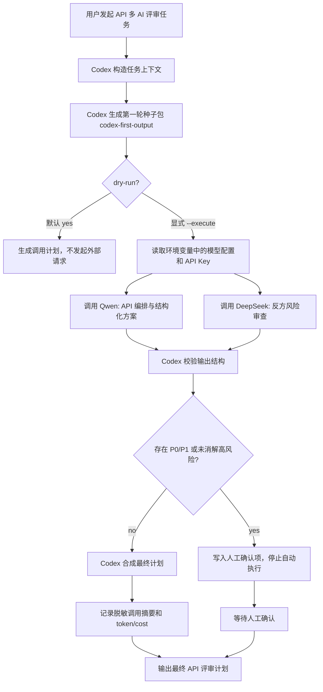
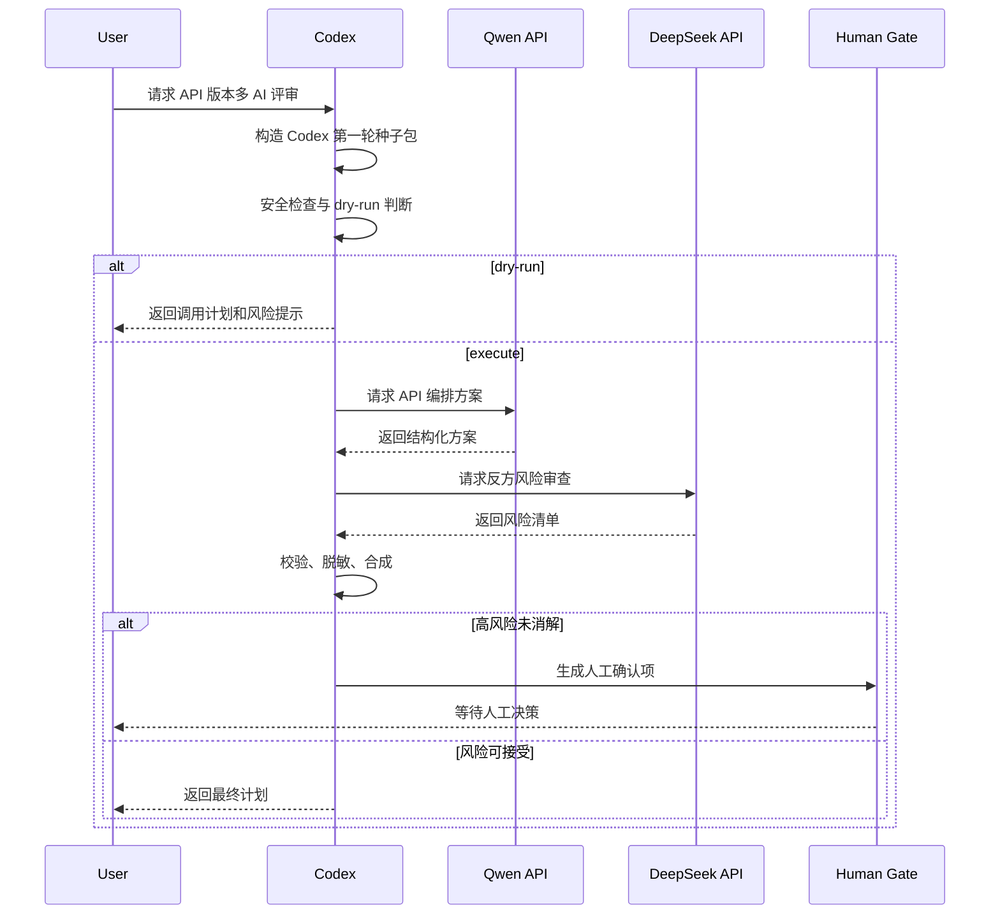

# API 版本多 AI 评审计划

## Summary

本计划把现有 prompt-only 多 AI 评审流程升级为 API-runner 模式：Codex 负责本地集成、裁决和人工门禁；Qwen 负责 API 编排与结构化方案；DeepSeek 负责反方风险审查。默认行为仍是安全的 dry-run，真实 API 调用必须显式开启。

本版本不继续扩展 full 模式的人工粘贴链路，而是新增一条更短、更明确的 API 评审路径。

Codex 第一轮产出物必须使用 `codex-first-output.md` 的结构：先生成本地种子包，再从同一份种子包派生 Qwen 和 DeepSeek 请求。`plans/codex.md` 仅保留为历史集成方案，不再作为 API-runner 第一轮输入标准。

## API Review Flow



## Key Changes

- 新增 API-runner 流程，不替换 prompt-only 流程；prompt-only 保留为无密钥或人工审查场景的 fallback。
- Codex 不再作为外部模型走 prompt 文件流，而是先生成第一轮种子包，再生成本地裁决和最终计划。
- Qwen 固定为主方案模型，职责是 API 编排、结构化输出、输入输出 schema、工程可维护性。
- DeepSeek 固定为反方审查模型，职责是安全边界、失败模式、成本失控、人工门禁和过度设计审查。
- 交叉评审阶段从默认流程中移除；只有出现争议、高风险或人工要求时才追加二次评审。

## Codex First Output Contract

API-runner 的第一步不是调用外部模型，而是由 Codex 生成一个本地种子包。种子包必须包含：

- `task_brief`：目标和非目标。
- `constraints`：安全、执行、成本、范围边界。
- `model_assignments`：Qwen、DeepSeek、Codex 的职责。
- `review_inputs`：外部模型收到的最小上下文。
- `adjudication_rules`：Codex 如何合成、拒绝或阻断方案。

标准见 `codex-first-output.md`。

## Public Interface

建议新增一个命令入口：

```bash
python3 tools/agent_context.py multi-review api-plan --task <task-id> --dry-run
python3 tools/agent_context.py multi-review api-plan --task <task-id> --execute
```

默认等价于 `--dry-run`。

参数语义：

- `--task <task-id>`：读取任务上下文和现有 artifact。
- `--models qwen,deepseek`：可选，默认使用 Qwen + DeepSeek。
- `--dry-run`：只展示将调用的模型、输入来源、输出目标、预估风险，不发起网络请求。
- `--execute`：显式发起外部 API 调用。
- `--output chat|artifact`：默认输出到聊天；需要沉淀时写入任务 artifact。

环境变量：

```bash
QWEN_BASE_URL="https://dashscope.aliyuncs.com/compatible-mode/v1"
QWEN_MODEL="qwen3.6-plus"
DASHSCOPE_API_KEY="<local-only>"

DEEPSEEK_BASE_URL="https://api.deepseek.com"
DEEPSEEK_MODEL="deepseek-v4-pro"
DEEPSEEK_API_KEY="<local-only>"

MULTI_REVIEW_API_CALLS="disabled"
MULTI_REVIEW_DRY_RUN="true"
```

真实密钥只能存在于本地环境变量或 `.env.local`，不得写入任务文档、日志、对话、代码示例或错误输出。

## Data Flow



## Error Handling

- `400`：请求格式、模型名或参数错误；不重试，要求修配置。
- `401/403`：认证或权限错误；不重试，停止并提示检查本地环境变量。
- `429`：限流；指数退避重试，最多 2 次。
- `5xx`：供应商服务错误；最多重试 2 次，失败后降级为人工处理。
- 超时：不使用半结果合成最终计划，标记 provider 超时。
- 输出为空：视为模型输出失败；DeepSeek thinking 模型需要避免过低 `max_tokens`，必要时不传 `max_tokens`。
- 输出结构不合格：不进入 Codex 合成，要求重试或人工确认。

## Safety Rules

- 禁止打印 `Authorization` header、API Key、token 或完整环境变量。
- 禁止在 `ps` 可见的命令参数中直接暴露真实 Authorization header；正式实现应使用 Python/SDK 在内存中设置 header。
- 禁止把完整 request body 和 response body 写入长期日志；只允许写脱敏摘要。
- DeepSeek 标记 P0/P1 或高风险未消解时，Codex 必须停止自动执行。
- 涉及生产配置、数据库、权限、资金、密钥轮换、隐私数据的步骤必须人工确认。

## Cost and Audit

每次真实调用记录脱敏摘要：

```json
{
  "run_id": "20260517-...",
  "provider": "qwen|deepseek",
  "model": "...",
  "phase": "api-plan|risk-review",
  "status": "ok|failed",
  "prompt_tokens": 0,
  "completion_tokens": 0,
  "total_tokens": 0,
  "estimated_cost": "optional",
  "artifact": "optional"
}
```

不得记录：

- API Key
- Authorization header
- 完整 prompt 中的敏感业务数据
- 完整 response 中的敏感内容
- 内网地址、真实凭证、用户隐私数据

## Test Plan

- Dry-run 测试：未传 `--execute` 时不发起任何外部请求，只输出调用计划。
- Qwen 链路测试：使用 `qwen3.6-plus` 请求最小 OK prompt，确认可返回正文。
- DeepSeek 链路测试：使用 `deepseek-v4-pro`、`thinking.enabled`、`reasoning_effort=high`、`stream=false` 请求最小 OK prompt；避免过低 `max_tokens` 导致正文为空。
- 安全测试：错误路径、日志和命令输出中不得出现 API Key、Authorization header 或真实 token。
- 合成测试：Qwen 成功、DeepSeek 成功时，Codex 能生成最终计划；任一模型失败时，输出必须标明缺失来源并降级。
- 人工门禁测试：DeepSeek 输出高风险未消解项时，不生成可执行计划，只生成确认项。

## Assumptions and Defaults

- Qwen 默认模型：`qwen3.6-plus`。
- DeepSeek 默认模型：`deepseek-v4-pro`。
- Qwen 使用 DashScope OpenAI-compatible endpoint。
- DeepSeek 使用官方 OpenAI-compatible endpoint，并按官方文档启用 thinking。
- API-runner 默认不写 artifact；用户要求沉淀时才写入任务目录。
- 本版本先实现串行调用，避免并发导致日志、安全和失败恢复复杂化。
- prompt-only 流程保留，但不再作为 API 版本的主路径。
