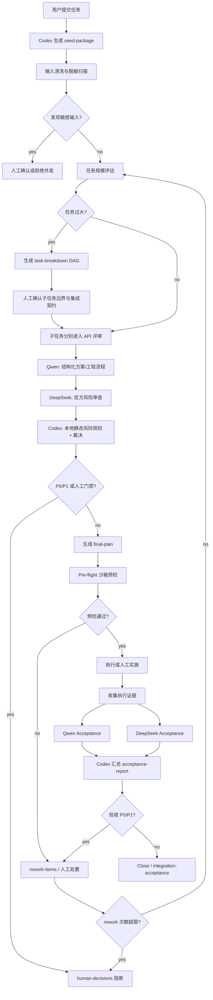

# 多轮 API 多 AI 评审最终方案

## Summary

核心目标是建立一套可执行、可拆分、可验收的多 AI 流程：通过多 AI 评审确认方案可行；任务过大时先拆成小任务并维护依赖；实现完成后再由多 AI 验收实际结果。

最终方案不把“多 AI 评审”当作单次聊天，而是定义为状态机驱动的工程流程：Codex 负责本地种子包、拆分、裁决、证据汇总；Qwen 负责结构化方案与工程一致性检查；DeepSeek 负责反方风险、安全边界和失败路径审查。

## Final Workflow



## Core States

```text
seeded
  -> sanitized
  -> needs_human_sanitization | decomposition_check
  -> task_breakdown_ready | review_ready
  -> review_ready
  -> adjudicated
  -> human_blocked | final_plan_ready
  -> preflight_ready
  -> preflight_failed | executing
  -> acceptance_ready
  -> acceptance_failed | accepted
  -> rework_planning | closed
```

## Required Artifacts

核心 artifact 应优先使用 JSON，Markdown 只作为人类可读副本。

- `api/seed-package.json`：目标、非目标、约束、模型职责、裁决规则。
- `api/safety-input-sanitization.json`：输入脱敏扫描结果。
- `api/task-breakdown.json`：子任务 DAG、依赖、执行顺序、合并策略。
- `api/qwen-output.json`：Qwen 结构化方案。
- `api/deepseek-review.json`：DeepSeek 风险审查。
- `api/adjudication.json`：Codex 裁决结果。
- `api/human-decisions.json`：人工确认记录。
- `api/final-plan.json`：最终执行计划。
- `api/preflight-report.json`：沙箱预检结果。
- `api/execution-trace.jsonl`：执行或人工实施证据摘要。
- `api/qwen-acceptance.json`：Qwen 验收结果。
- `api/deepseek-acceptance.json`：DeepSeek 验收结果。
- `api/acceptance-report.json`：Codex 最终验收报告。
- `api/rework-items.json`：返工项。
- `api/integration-acceptance.json`：多子任务集成验收。
- `api/artifact-chain.jsonl`：artifact 哈希链。
- `api/calls-log.jsonl`：API 调用摘要、usage 和状态。

## Task Decomposition Rules

任务过大时必须先拆分，不得直接进入多 AI 评审。

触发条件：

- 涉及 3 个以上模块、目录或职责域。
- 同时包含设计、实现、测试、文档、迁移、发布等多个阶段。
- 验收标准超过 7 条，且不能由同一组命令验证。
- 存在多个独立风险域，例如密钥安全、API 调用、状态机、CLI、artifact、验收报告。
- 单个 seed package 会迫使外部模型同时处理多个主题。

拆分要求：

- 每个子任务只有一个主要目标。
- 每个子任务有独立验收标准。
- `task-breakdown.json` 必须包含 `dependencies`、`execution_order`、`merge_strategy`。
- 拆分结果必须人工确认，确认前不得进入子任务评审。
- 所有子任务通过验收后，必须再做 `integration-acceptance`。

## Multi-AI Review Rules

评审阶段回答“方案是否合理”。

- Codex 生成 seed package，并负责输入清洗、拆分判断、静态风险规则和最终裁决。
- Qwen 检查流程、接口、schema、artifact、错误处理、验收标准是否完整。
- DeepSeek 检查安全边界、失败路径、过度设计、人工门禁和不可接受风险。
- Qwen/DeepSeek 输出失败、超时、空输出或解析失败时，不伪造意见；进入明确降级路径和人工确认。
- DeepSeek 不可作为唯一风险来源；Codex 必须内置静态风险规则。

## Pre-flight and Execution Evidence

多 AI 评审不能直接证明执行可行性。`final-plan` 之后必须有 Pre-flight 阶段。

Pre-flight 检查：

- 配置和语法有效性。
- 依赖工具和版本存在。
- 权限模拟或只读探测。
- 目标 endpoint 连通性，不发送敏感数据。
- artifact 哈希链完整性。

执行证据：

- 若由人工执行，记录命令、摘要、结果和证据路径。
- 若由 AI Agent 在沙箱执行，记录结构化 `execution-trace.jsonl`。
- 不记录密钥、Authorization、完整敏感 request/response。

## Multi-AI Acceptance Rules

验收阶段回答“实现结果是否满足最终计划”。

- Codex 收集 `final-plan`、preflight、execution trace、calls log、human decisions。
- Qwen Acceptance 验收工程符合度：流程、schema、artifact、错误处理、验收标准。
- DeepSeek Acceptance 验收安全边界：密钥、双重开关、失败降级、人工门禁、敏感信息泄露。
- Codex 生成 `acceptance-report.json`，包含 `pass/fail`、`evidence_refs`、`rework_scope`、`next_action`。
- 任何 P0 或未消解 P1 导致验收失败。
- `rework-items` 必须回流到计划修订或子任务重试，最多 3 次；超限转人工决策。

## Safety Rules

- API Key 只来自本地环境变量。
- 禁止把 Authorization 放入命令行参数、artifact、日志或对话。
- 外发给模型的输入必须先脱敏；无法脱敏则不得进入外部模型管道。
- 真实外部 API 调用必须同时满足 `MULTI_REVIEW_API_CALLS=enabled` 和 `--execute`。
- dry-run 的严格定义：不调用外部模型，只做本地规则检查、schema 检查、配置预检和调用计划展示。
- 生产配置、数据库、权限、资金、密钥轮换、隐私数据默认触发人工确认。

## Cost Policy

按用户决策，不设置 token/cost 硬上限，不因预算阈值阻断调用。

仍必须记录：

- provider
- model
- phase
- status
- prompt_tokens
- completion_tokens
- total_tokens
- trace_id
- seed_hash

可以做非阻断提醒：若单任务 usage 异常升高，只记录 warning，不自动停止当前流程。

## Degradation Matrix

| Failure | Action |
|---|---|
| 输入脱敏命中 | 停止外发，进入人工确认。 |
| Qwen 失败 | 重试一次；仍失败则标记缺少 Planner 输出，进入人工确认。 |
| DeepSeek 失败 | 重试一次；仍失败则标记无反方检查，强制人工确认。 |
| 输出解析失败 | 重试一次；仍失败则 `parse_failed`，不得合成可执行 final plan。 |
| Pre-flight 失败 | 生成 rework-items，不进入执行。 |
| Acceptance P0/P1 | 验收失败，进入 rework。 |
| Rework 超过 3 次 | 停止自动回流，进入人工决策。 |

## Implementation Phases

- Phase 1：Schema-first artifact、本地输入脱敏、双重开关、Qwen/DeepSeek API 调用、Codex 裁决、artifact 哈希链。
- Phase 2：任务拆分 DAG、Pre-flight、rework 回流、多 AI 验收。
- Phase 3：集成验收、规则版本化、可视化 trace、模型路由优化。

## Final Acceptance Criteria

- 大任务会先拆分并人工确认，不会直接进入评审。
- 多 AI 评审能产出裁决、人工确认项和 final-plan。
- final-plan 后必须经过 Pre-flight，不直接执行。
- 实现完成后必须经过 Qwen/DeepSeek 多 AI 验收。
- 验收失败能回流到 rework，且有次数上限。
- 所有关键 artifact 有 trace_id 和 hash。
- 不泄露 API Key、Authorization 或敏感输入。
- token/cost 有记录但不阻断。
