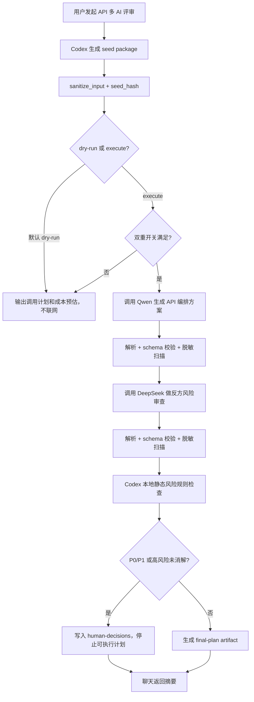
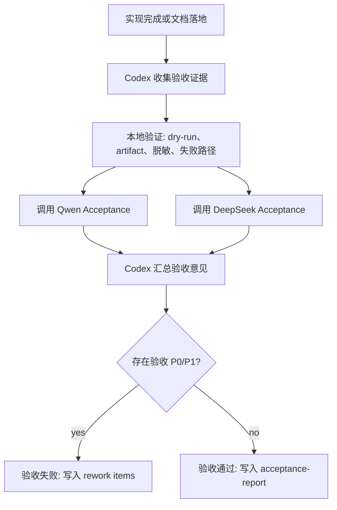
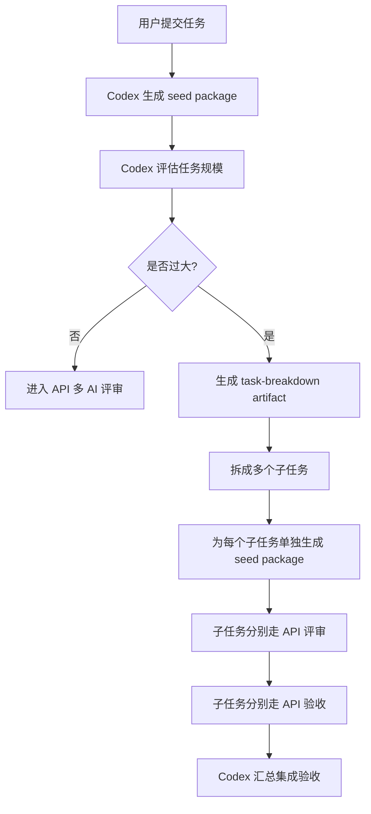

# Final Plan

## Summary

构建 API 版本多 AI 评审方案时，不继续扩展 prompt-only full 流程。最终方案采用 API-runner 简化路径：Codex 生成第一轮种子包，Qwen 生成 API 编排方案，DeepSeek 做反方风险审查，Codex 基于确定性规则裁决并输出 artifact。

第一版只生成评审计划和人工确认项，不自动执行代码修改或外部分派。

## Final Flow



## Required Interfaces

新增命令建议：

```bash
python3 tools/agent_context.py multi-review api-plan --task <task-id> --dry-run
python3 tools/agent_context.py multi-review api-plan --task <task-id> --execute
```

默认行为：`--dry-run`。

真实调用要求：

```bash
MULTI_REVIEW_API_CALLS="enabled"
python3 tools/agent_context.py multi-review api-plan --task <task-id> --execute
```

默认 artifact：

- `api/seed-package.json`
- `api/qwen-output.md`
- `api/deepseek-review.md`
- `api/adjudication.md`
- `api/human-decisions.md`
- `api/final-plan.md`
- `api/calls-log.jsonl`

## Minimum Schema

Qwen 输出至少包含：

```json
{
  "summary": "",
  "flow": [],
  "interfaces": [],
  "error_handling": [],
  "cost_audit": [],
  "acceptance_criteria": []
}
```

DeepSeek 输出至少包含：

```json
{
  "assumptions": [],
  "findings": [
    {
      "severity": "P0|P1|P2|P3",
      "title": "",
      "evidence": "",
      "recommendation": ""
    }
  ],
  "human_gates": [],
  "simplified_flow": []
}
```

解析策略：

- 允许模型返回 Markdown，但必须能提取结构化段落或 JSON 块。
- 最多重试 2 次；仍失败则标记 `parse_failed`，进入人工确认。
- 不允许因解析失败而伪造模型意见。

## Security Requirements

- API Key 只从环境变量读取。
- 禁止把 Authorization header 放入命令行参数、日志、artifact 或对话。
- API client 必须在内存中设置 header，并对错误输出做脱敏扫描。
- seed package 生成前必须清洗用户输入中的角色伪造、越权指令、密钥索取、环境变量枚举请求。
- Codex 必须内置静态风险规则：生产配置、数据库、权限、资金、密钥轮换、隐私数据默认触发人工确认。

## Cost and Audit

每次 API 调用记录成本信息，但不做 token/cost 硬上限阻断：

- 输入长度估算。
- 不设置每任务 token 上限。
- 不设置每日调用成本上限。
- dry-run 下只输出预估，不联网。

调用日志只记录脱敏摘要：

```json
{
  "trace_id": "",
  "seed_hash": "",
  "provider": "qwen|deepseek",
  "model": "",
  "phase": "plan|risk-review",
  "status": "ok|failed|parse_failed",
  "prompt_tokens": 0,
  "completion_tokens": 0,
  "total_tokens": 0
}
```

## Acceptance Criteria

- 默认 dry-run 不发起网络请求。
- `--execute` 必须同时满足 `MULTI_REVIEW_API_CALLS=enabled` 才发起真实调用。
- Qwen 与 DeepSeek 输出均落 artifact，聊天只返回摘要。
- token/cost 被记录但不作为调用阻断条件。
- 任一 P0 或未消解 P1 会阻断可执行 final plan。
- 任一模型失败、超时、空输出或解析失败时，最终输出必须标明缺失来源并降级为人工确认。
- 调用日志不包含 key、Authorization header、完整 request body 或完整 response body。
- Codex 第一轮产出物清晰可追溯，包含 seed hash。

## Explicit Non-goals

- 第一版不自动修改代码。
- 第一版不自动创建 PR。
- 第一版不自动执行外部分派。
- 第一版不实现复杂多供应商平台，只支持 Qwen + DeepSeek 的最小闭环。

## Multi-AI Acceptance Phase

当前方案必须增加独立的多 AI 验收阶段。评审回答“方案是否合理”，验收回答“实现结果是否满足最终计划”。两者不能混用。

验收阶段在实现或文档落地后触发，输入是：

- `api/final-plan.md`
- 实际改动摘要或 diff
- 运行命令与输出摘要
- `api/calls-log.jsonl`
- 人工确认项状态

验收角色：

- Codex：执行本地检查、汇总证据、生成最终验收结论。
- Qwen：检查 API runner 是否按计划实现流程、schema、artifact、错误处理和成本记录。
- DeepSeek：检查安全边界、密钥处理、误调用风险、人工门禁和失败降级。

验收流程：



建议新增命令：

```bash
python3 tools/agent_context.py multi-review api-accept --task <task-id> --dry-run
python3 tools/agent_context.py multi-review api-accept --task <task-id> --execute
```

默认 artifact：

- `api/acceptance-evidence.md`
- `api/qwen-acceptance.md`
- `api/deepseek-acceptance.md`
- `api/acceptance-report.md`
- `api/rework-items.md`

Qwen 验收必须检查：

- 命令接口是否符合最终计划。
- dry-run 是否默认不联网。
- artifact 是否按约定生成。
- Qwen/DeepSeek 输出 schema 是否可解析。
- token/cost 是否记录但不阻断。

DeepSeek 验收必须检查：

- API Key 是否只来自环境变量。
- Authorization 是否不会出现在命令行参数、日志、artifact、错误输出中。
- `--execute` 是否必须配合 `MULTI_REVIEW_API_CALLS=enabled`。
- P0/P1 或静态高风险规则是否阻断可执行计划。
- 模型失败、超时、空输出、解析失败是否进入人工确认或 rework。

验收通过条件：

- 本地验证通过。
- Qwen Acceptance 无 P0/P1。
- DeepSeek Acceptance 无 P0/P1。
- 所有人工确认项为 approved 或明确标记为 not_applicable。
- `acceptance-report.md` 明确写出 pass/fail、证据路径和剩余风险。

验收失败条件：

- 任一 P0。
- 未消解 P1。
- 密钥或 Authorization 泄露。
- dry-run 发起真实外部请求。
- `--execute` 绕过双重开关。
- 失败路径生成了可执行 final plan。

## Task Decomposition Gate

API-runner 必须在多 AI 评审前增加任务拆分门禁。大任务不能直接进入 Qwen/DeepSeek 评审，否则会导致上下文过长、模型输出发散、成本不可控、验收无法闭环。

拆分门禁由 Codex 本地执行，发生在 seed package 生成之后、调用 Qwen 之前。



判定为“大任务”的条件：

- 涉及 3 个以上独立模块或目录。
- 同时包含协议设计、代码实现、测试、文档、迁移、发布等多个阶段。
- 验收标准超过 7 条，且不能由同一组命令验证。
- 存在多个互相独立的风险域，例如密钥安全、API 调用、状态机、CLI、artifact、验收报告。
- 单个 seed package 预计超过模型上下文或会迫使 Qwen/DeepSeek 同时处理多个主题。
- 需要不同人工确认人分别确认不同风险项。

拆分输出 artifact：

- `api/task-breakdown.md`
- `api/subtasks/<subtask-id>/seed-package.json`
- `api/subtasks/<subtask-id>/qwen-output.md`
- `api/subtasks/<subtask-id>/deepseek-review.md`
- `api/subtasks/<subtask-id>/final-plan.md`
- `api/subtasks/<subtask-id>/acceptance-report.md`
- `api/integration-acceptance.md`

子任务拆分原则：

- 每个子任务只有一个主要目标。
- 每个子任务有独立验收标准。
- 每个子任务可以单独评审、实现、验收。
- 子任务之间的依赖必须显式记录。
- 不允许把“共享上下文”当作隐式依赖。

本任务如果进入实现阶段，建议拆成 4 个子任务：

1. `api-runner-core`：环境变量、双重开关、Qwen/DeepSeek API client、脱敏日志。
2. `seed-and-schema`：Codex seed package、输入清洗、输出 schema、解析容错。
3. `review-adjudication`：Qwen plan、DeepSeek risk review、Codex 裁决、human decisions。
4. `acceptance-phase`：多 AI 验收、acceptance evidence、acceptance report、rework items。

集成验收要求：

- 所有子任务 acceptance-report 为 pass。
- 子任务间依赖均已满足。
- 没有遗留 P0/P1。
- `api/integration-acceptance.md` 汇总最终状态和剩余风险。
